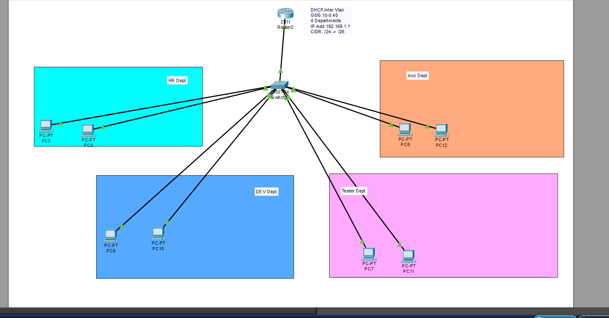
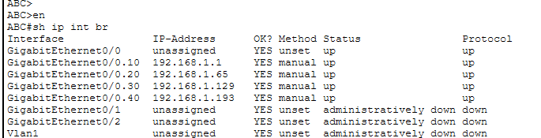

# Multi-Vlan

# 🚀 4-Department Enterprise VLAN/DHCP Lab (Cisco Packet Tracer)

**192.168.1.0/24 → 4 Equal /26 Subnets | Router-on-a-Stick | Multi-VLAN DHCP**

## 📋 Project Overview
Designed enterprise network for 4 departments (HR, Dev, Test, OP) using:
- **Router-on-a-Stick** (Gig0/0.10-.40 subinterfaces)
- **4×/26 subnets** (62 hosts/department)  
- **DHCP automation** per VLAN
- **802.1Q trunking** verification

## 🏗️ Network Design

- HR (VLAN10): 192.168.1.0/26 Gateway: .1
- Dev (VLAN20): 192.168.1.64/26 Gateway: .65
- Test (VLAN30): 192.168.1.128/26 Gateway: .129
- OP (VLAN40): 192.168.1.192/26 Gateway: .193


## 🔧 Key Configurations

**Router Subinterfaces:**
```bash
interface Gig0/0.10
 encapsulation dot1Q 10
 ip address 192.168.1.1 255.255.255.192
```

**DHCP Pools:**
```bash
ip dhcp pool HR
 network 192.168.1.0 255.255.255.192
 default-router 192.168.1.1
```

## 🐛 Troubleshooting Journey
1. **APIPA (169.254.x.x)** → Fixed subinterfaces `no shutdown`
2. **DHCP pool conflicts** → Corrected /26 subnet boundaries  
3. **VLAN port misassignment** → `show vlan brief` verification
4. **Trunk verification** → `show interfaces trunk`

## 📊 Validation
- show ip dhcp binding ← All 4 pools assigning
- show interfaces trunk ← VLANs 10,20,30,40 active
- show ip route ← 4×/26 connected routes

## 📷 Screenshots
**Topology**



**Router**
 ```
 Sh ip int br
 ```
 

 - Router in Dhcp
   
 ```
 sh ip pool
````
 
- Router-on-a-Stick (802.1Q)
- Multi-VLAN DHCP Server
- Cisco IOS Troubleshooting
- Enterprise Network Design

## 📱 Try It Yourself
Download `4-dept-vlan-dhcp.pkt` and explore!

**#CCNA #Networking #CiscoPacketTracer #VLAN #DHCP**

